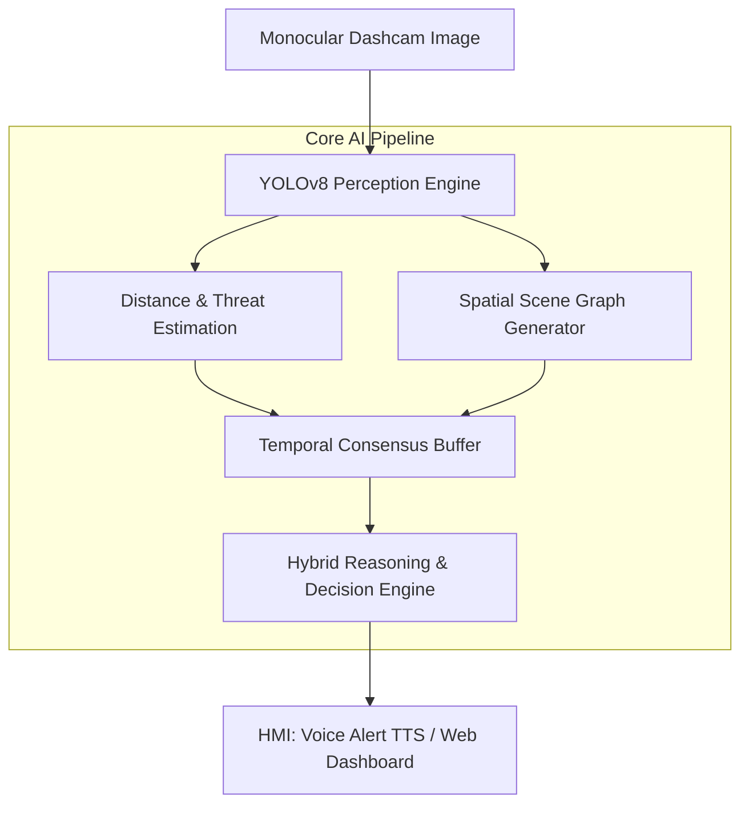

#  Indian Road Intelligence System (IRIS)
> **“From Perception to Explanable Reasoning — An AI Driving Brain for Complex, Non-Lane-Disciplined Environments.”**

[](#)
[](#)
[](#)
[](#)

---

##  Executive Summary & Commercial Value Proposition

Traditional Advanced Driver Assistance Systems (ADAS) and Autonomous Vehicle (AV) perception stacks are designed for highly structured, lane-disciplined driving environments typical of Western highways. When deployed in emerging markets—particularly India—these systems frequently fail or experience alarm fatigue. 

The **Indian Road Intelligence System (IRIS)** is a proprietary, explainable AI (XAI) copilot and driver assistance brain specifically engineered to handle the unique, non-structured traffic dynamics of Indian urban and rural roadways.

### The Market Opportunity
* **Unstructured Mixed Traffic**: Roads shared by heavy commercial vehicles, high-speed passenger cars, vulnerable auto-rickshaws, pedestrians, and domestic animals (cows, stray dogs, elephants).
* **Non-Lane Discipline**: Vehicles operate based on spatial negotiation rather than strict lane boundaries, rendering conventional lane-keep algorithms ineffective.
* **Economic Impact**: Over 150,000 traffic fatalities occur annually in India, with logistics and insurance providers bearing over $20B in losses. IRIS offers an integratable API and dashboard to mitigate these risks.

### Key Commercial Features
*  **Hybrid Reasoning Stack**: Combines deterministic offline rule-based heuristics with cloud-based Vision-Language Models (VLM) for zero-latency fail-safe operation and complex contextual reasoning.
*  **Perspective-Aware Threat Intelligence**: Uses geometric homography and ground-projection equations to calculate real-world object distances from a single monocular dashcam stream without requiring expensive LiDAR hardware.
*  **Natural Language Safety Explanations**: Generates real-time, low-latency Voice Alerts explaining *why* a decision was made (e.g., *"Warning: Pedestrian detected 8 meters ahead in your path. Slow down immediately."*).
*  **Temporal Decision Smoothing**: A sliding-window temporal consensus engine filters transient sensor noise and prevents sudden, jittery warnings that lead to driver fatigue.

---

##  System Architecture & Workflow

IRIS processes video frames sequentially through a highly modular, decoupled pipeline:



---

##  Scientific & Theoretical Framework

### 1. Monocular Perspective-Aware Distance Estimation
IRIS estimates the physical distance $d$ to detected objects using a geometric model that maps image-space coordinate changes to 3D world coordinates. The system dynamically alternates between two methods based on the object's relationship to the horizon:

#### A. Ground-Plane Perspective Projection (Primary)
Assuming flat-ground camera mounting, the distance $d$ (in meters) to the contact point of an object is inversely proportional to its pixel distance below the horizon line:

$$d = \frac{H_{\text{cam}} \cdot f}{\max(1, y_{\text{bottom}} - y_{\text{horizon}})}$$

Where:
* $H_{\text{cam}}$: Camera height above ground plane ($1.35\text{m}$).
* $f$: Camera focal length in pixels ($800.0\text{px}$).
* $y_{\text{bottom}}$: Lower boundary coordinate of the bounding box.
* $y_{\text{horizon}}$: Camera horizon pixel row ($0.45 \times \text{Image Height}$).

#### B. Bounding Box Height-Ratio Fallback (Secondary)
If the contact point is near or above the horizon (e.g., during slope changes or extreme pitch), the system falls back to a physical height ratio estimation:

$$d_{\text{fallback}} = \frac{h_{\text{real}} \cdot f}{h_{\text{bbox}}}$$

Where $h_{\text{real}}$ is the average empirical physical height of the object class (e.g., $1.7\text{m}$ for pedestrians, $3.5\text{m}$ for trucks) and $h_{\text{bbox}}$ is the height of the bounding box in pixels.

---

### 2. Multi-Object Threat Index Formulation
Objects are ranked using a dynamic Threat Risk Score ($TR$) that models collision probability. The score penalizes proximity, trajectory relevance (lane centering), and the intrinsic risk profile of the object class:

$$TR = \left( \frac{W_{\text{risk}} \cdot S_{\text{motion}} \cdot L_{\text{lane}}}{d} \right) \times 100$$

Where:
* $W_{\text{risk}}$: Base threat weight assigned to the object class (e.g., `pedestrian` = 10, `cow` = 9, `truck` = 8, `traffic_light` = 2).
* $S_{\text{motion}}$: Motion sensitivity/erratic behavior index (e.g., `stray_dog` = 1.4, `pedestrian` = 1.3, `car` = 1.0, `truck` = 0.8).
* $L_{\text{lane}}$: Lane multiplier penalty. Objects situated in the *Ego Lane* (center 35% of the frame) receive a $2.5\times$ penalty; others receive $1.0\times$.
* $d$: Estimated distance to the object in meters.

#### Threat Classification Thresholds
$$\text{Risk Level} = \begin{cases} 
\text{CRITICAL} & \text{if } TR > 150 \\
\text{HIGH} & \text{if } 80 < TR \le 150 \\
\text{MEDIUM} & \text{if } 30 < TR \le 80 \\
\text{LOW} & \text{if } TR \le 30 
\end{cases}$$

---

### 3. Spatial Scene Graph Formulation
The scene is represented as a directed graph $G = (V, E)$ where:
* **Nodes ($V$)**: Detected objects $v_i \in V$, each parameterized by class, center coordinates $(cx_i, cy_i)$, area ratio, and estimated distance $d_i$.
* **Edges ($E$)**: Relational edges $e_{ij} = (v_i, R, v_j)$ where $R \in$ {`left_of`, `right_of`, `ahead_of`, `behind`, `near`, `aligned_with`}.

#### Spatial Edge Induction Rules
1. **Horizontal Orientation Dominance**: If $|\Delta cx| > |\Delta cy|$:
   $$\text{Relation}(v_i, v_j) = \begin{cases} \text{left-of} & \text{if } cx_j - cx_i > 0.05 \\ \text{right-of} & \text{if } cx_j - cx_i < -0.05 \end{cases}$$
2. **Proximity-Based Density Clustering**: An undirected sub-graph edge is established if the Euclidean distance between bounding box centers is within the threshold:
   $$\text{Near}(v_i, v_j) \iff \sqrt{(cx_i - cx_j)^2 + (cy_i - cy_j)^2} < 0.15$$
   Objects sharing "Near" edges are grouped into dense clusters to signal local road congestion or pedestrian crowd bottlenecks.

---

### 4. Temporal Consensus Engine
To prevent warning chattering due to occlusion or detection dropouts, IRIS maintains a sliding temporal window buffer $B = \{F_{t-k}, \ldots, F_t\}$ representing the last $\Delta t = 6.0\text{ seconds}$ (up to 30 frames). The final action emitted is the result of a priority-weighted consensus:

$$\text{Consensus Action} = \arg\max_{a} \left( P(a) \right) \text{ where } a \in \text{Decisions}(B)$$

Where $P(a)$ maps actions to their severity rankings (e.g., `emergency_brake` = 5, `slow_down` = 3, `proceed_normally` = 0).

---

### 5. Hybrid Reasoning Stack
IRIS implements a hybrid safety-critical reasoning stack:
1. **Rule-Based Engine (Deterministic - Edge)**: Evaluates spatial scene graphs and threat indexes against safe driving templates. Runs fully offline at $<5\text{ms}$ latency.
2. **VLM/LLM Engine (Cognitive - Cloud)**: When online, the system encodes the JSON spatial graph representation and sends it to a reasoning model (GPT-4 / Groq) to deduce multi-agent intent and navigate highly nuanced situations (e.g., anticipating a pedestrian dodging an auto-rickshaw).


##  Getting Started

### Prerequisites
* Python 3.9+
* Node.js 18+ (for frontend)
* Git

### Local Environment Setup

1. **Clone the Repository:**
   ```bash
   git clone <your-repo-url>
   cd indian-road-intelligence
   ```

2. **Backend Setup:**
   ```bash
   # Create virtual environment
   python -m venv venv
   source venv/bin/activate  # On Windows: .\venv\Scripts\activate

   # Install required packages
   pip install -r requirements.txt
   ```

3. **Frontend Setup:**
   ```bash
   # Dependencies will be installed automatically when running locally
   cd web
   npm install
   cd ..
   ```

4. **Environment Variables Configuration:**
   Copy the example environment file and configure your parameters:
   ```bash
   cp .env.example .env
   ```
   *For cognitive reasoning, provide your `OPENAI_API_KEY` or `GROQ_API_KEY` in `.env` and set `USE_LLM=true`.*

---

##  Running the Application

### 1. Unified Development Launch (Recommended)
You can launch both the frontend and backend simultaneously:

* **FastAPI Backend (Terminal 1):**
  ```bash
  source venv/bin/activate
  python -m uvicorn api.main:app --host 127.0.0.1 --port 8000 --reload
  ```
  * Access API docs at [http://127.0.0.1:8000/docs](http://127.0.0.1:8000/docs)

* **React Frontend Dashboard (Terminal 2):**
  ```bash
  npm run dev
  ```
  * Access the Glassmorphic UI Dashboard at [http://localhost:5173](http://localhost:5173)

### 2. Multi-Container Orchestration (Docker Compose)
Deploy the production-ready build of the stack:
```bash
docker-compose up --build
```
* **Production API**: `http://localhost:8000`
* **Production Web UI**: `http://localhost:3000`

---

##  API Documentation

### `POST /analyze`
Analyzes a road scene image and outputs a complete visual-spatial representation, threat levels, and reasoning decisions.

#### Request Form Data:
* `file`: Image file (binary).
* `generate_voice`: `true`/`false` (generate TTS MP3 base64).
* `generate_viz`: `true`/`false` (generate annotated bounding box image).

#### Example Response (JSON):
```json
{
  "success": true,
  "filename": "road_scene_01.jpg",
  "detections": {
    "objects": [
      { "type": "cow", "confidence": 0.92, "bbox": [100, 310, 220, 430] },
      { "type": "pedestrian", "confidence": 0.88, "bbox": [320, 350, 350, 450] }
    ],
    "count": 2
  },
  "scene_graph": {
    "relations": [
      { "subject": "cow_1", "relation": "left_of", "object": "pedestrian_1", "distance": 0.35 }
    ],
    "zones": {
      "left": [],
      "center": [ { "name": "cow_1" }, { "name": "pedestrian_1" } ],
      "right": []
    },
    "ego_view": {
      "ahead": [ { "name": "cow_1" }, { "name": "pedestrian_1" } ],
      "left_side": [],
      "right_side": []
    }
  },
  "distances": {
    "distances": [
      { "type": "cow", "estimated_meters": 6.8, "lane": "ego", "zone": "near", "urgency": "high" },
      { "type": "pedestrian", "estimated_meters": 11.2, "lane": "ego", "zone": "medium", "urgency": "moderate" }
    ],
    "threat_report": {
      "primary_threat": { "type": "cow", "distance_m": 6.8, "lane": "ego", "risk_level": "CRITICAL", "risk_score": 330.88 },
      "recommended_action": "Brake immediately. Cow in your path at 6.8m."
    }
  },
  "reasoning": {
    "context": "Cow detected ahead. Pedestrian nearby.",
    "decision": "emergency_brake",
    "risk": "critical",
    "alert": "Warning! Cow on the road ahead. Apply brakes immediately."
  }
}
```

### `POST /analyze/quick`
High-speed endpoint returning only the driving decision and voice warnings, optimized for edge-device integration.

---

##  iOS Integration & Client Setup Guide

This section explains how to use an iOS device (e.g., iPhone mounted as a dashcam) as a hardware peripheral that streams camera frames to the IRIS server and plays voice alerts in real-time.

### 1. Network Configuration
To allow your iOS device to connect to the FastAPI backend running on your Mac/server:
1. Locate your local IP address in the terminal:
   ```bash
   ipconfig getifaddr en0
   # Example output: 192.168.1.15
   ```
2. Ensure the backend server is configured to bind to `0.0.0.0` (all interfaces) rather than `127.0.0.1` by checking the `.env` settings (`API_HOST=0.0.0.0`).
3. Start the FastAPI backend:
   ```bash
   ./venv/bin/python -m uvicorn api.main:app --host 0.0.0.0 --port 8000
   ```
4. Confirm your iPhone is on the same local Wi-Fi network and can reach `http://<YOUR_LOCAL_IP>:8000/health` in Safari.

### 2. iOS Swift Integration Code
Use the following `IRISClient` Swift class in your Xcode project (`SwiftUI`/`UIKit`) to capture camera frames, POST them to the API, and play the base64 voice alerts using `AVAudioPlayer`:

```swift
import Foundation
import AVFoundation
import UIKit

class IRISClient: ObservableObject {
    @Published var recommendedAction: String = "Initializing..."
    @Published var riskLevel: String = "none"
    @Published var isProcessing = false
    
    private var audioPlayer: AVAudioPlayer?
    // Replace <YOUR_MAC_IP> with your local IP from step 1
    private let serverURL = URL(string: "http://<YOUR_MAC_IP>:8000/analyze")!
    
    /// Send an image frame to the IRIS backend
    func analyzeFrame(image: UIImage) async {
        guard !isProcessing else { return }
        
        await MainActor.run {
            self.isProcessing = true
        }
        
        // Convert UIImage to JPEG data
        guard let imageData = image.jpegData(compressionQuality: 0.7) else {
            return
        }
        
        let boundary = "Boundary-\(UUID().uuidString)"
        var request = URLRequest(url: serverURL)
        request.httpMethod = "POST"
        request.setValue("multipart/form-data; boundary=\(boundary)", forHTTPHeaderField: "Content-Type")
        
        var body = Data()
        
        // Add file parameter
        body.append("--\(boundary)\r\n".data(using: .utf8)!)
        body.append("Content-Disposition: form-data; name=\"file\"; filename=\"frame.jpg\"\r\n".data(using: .utf8)!)
        body.append("Content-Type: image/jpeg\r\n\r\n".data(using: .utf8)!)
        body.append(imageData)
        body.append("\r\n".data(using: .utf8)!)
        
        // Add request flags
        body.append("--\(boundary)\r\n".data(using: .utf8)!)
        body.append("Content-Disposition: form-data; name=\"generate_voice\"\r\n\r\n".data(using: .utf8)!)
        body.append("true\r\n".data(using: .utf8)!)
        
        body.append("--\(boundary)\r\n".data(using: .utf8)!)
        body.append("Content-Disposition: form-data; name=\"generate_viz\"\r\n\r\n".data(using: .utf8)!)
        body.append("false\r\n".data(using: .utf8)!) // Disable image viz on server to save bandwidth
        
        body.append("--\(boundary)--\r\n".data(using: .utf8)!)
        request.httpBody = body
        
        do {
            let (data, _) = try await URLSession.shared.data(for: request)
            let response = try JSONDecoder().decode(IRISResponse.self, from: data)
            
            await MainActor.run {
                self.recommendedAction = response.distances.threatReport.recommendedAction
                self.riskLevel = response.reasoning.risk
                
                // Play TTS Voice warning if available
                if let base64Audio = response.voiceAlert?.audioBase64 {
                    self.playVoiceAlert(base64String: base64Audio)
                }
                self.isProcessing = false
            }
        } catch {
            print("IRIS Pipeline Error: \(error.localizedDescription)")
            await MainActor.run {
                self.isProcessing = false
            }
        }
    }
    
    /// Decode and play the voice alert base64 audio block
    private func playVoiceAlert(base64String: String) {
        guard let audioData = Data(base64Encoded: base64String) else { return }
        do {
            // Configure audio session for playback
            try AVAudioSession.sharedInstance().setCategory(.playback, mode: .default)
            try AVAudioSession.sharedInstance().setActive(true)
            
            self.audioPlayer = try AVAudioPlayer(data: audioData)
            self.audioPlayer?.play()
        } catch {
            print("Audio Player Error: \(error.localizedDescription)")
        }
    }
}

// Codable structures matching the FastAPI JSON schema
struct IRISResponse: Codable {
    let success: Bool
    let distances: IRISDistances
    let reasoning: IRISReasoning
    let voiceAlert: IRISVoiceAlert?
    
    enum CodingKeys: String, CodingKey {
        case success, distances, reasoning
        case voiceAlert = "voice_alert"
    }
}

struct IRISDistances: Codable {
    let threatReport: IRISThreatReport
    
    enum CodingKeys: String, CodingKey {
        case threatReport = "threat_report"
    }
}

struct IRISThreatReport: Codable {
    let recommendedAction: String
    
    enum CodingKeys: String, CodingKey {
        case recommendedAction = "recommended_action"
    }
}

struct IRISReasoning: Codable {
    let risk: String
}

struct IRISVoiceAlert: Codable {
    let audioBase64: String?
    
    enum CodingKeys: String, CodingKey {
        case audioBase64 = "audio_base64"
    }
}
```

### 3. On-Device Inference via CoreML (Optional Offline Mode)
For fully offline, low-latency deployment directly on the iOS device:
1. Export the YOLOv8 model to CoreML format from the Python backend:
   ```python
   from ultralytics import YOLO
   model = YOLO("yolov8n.pt")
   model.export(format="coreml", nms=True)  # Generates yolov8n.mlpackage
   ```
2. Import the `yolov8n.mlpackage` into your Xcode project.
3. Utilize the `Vision` framework (`VNCoreMLModel`) to perform on-device object detection.
4. Port the spatial graph and threat logic from `src/graph.py` and `src/distance.py` to Swift using camera lens parameters.

---

## 🔬 Testing & Verification
A comprehensive suite of unit and integration tests covers model instantiation, distance calculations, graph edge induction, and reasoning logic.

To run the verification suite:
```bash
./venv/bin/pytest
```


